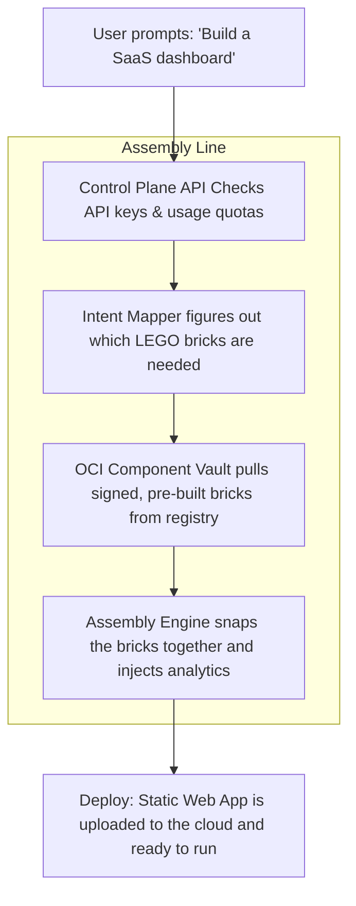

# Beloved (beloved.build)

> *You built something Lovable. Now make it Beloved.*

Beloved is a high-speed engine designed to build and deploy applications instantly. 

Traditional AI-powered code generators work by writing code line-by-line. This is slow, expensive, and frequently leads to bugs or hallucinations. Beloved takes a different approach: it acts as a digital assembly line. Instead of writing code from scratch, it fetches pre-built, secure components (like a login button, a database, or a pricing page) from a container registry and stitches them together deterministically.

---

## How It Works

Imagine building with LEGO bricks. Instead of melting plastic to mold a new brick every time you need one, you open a box of pre-made bricks and snap them together. 



1. **The Request**: A user submits a prompt describing the app they want to build.
2. **The Blueprint**: The Control Plane checks security access and maps the user's prompt to a list of required components.
3. **The Warehouse**: The Assembly Engine pulls these components (stored securely as OCI container layers) from the vault.
4. **Snapping It Together**: The engine stitches the components together, injects analytics, runs cryptographic security checks, and deploys a fully functioning web application to the cloud in seconds.

---

## Under the Hood

For engineering teams looking at our architecture:

* **Control Plane API**: A high-performance Web API built using ASP.NET Core. It handles user management, API keys, subscription tracking, and webhook notifications.
* **Assembly Engine**: A lightweight C# engine that processes code templates and pulls modules. It executes plugins dynamically to inject configurations.
* **OCI Component Vault**: An OCI-compliant registry store. Every component (React apps, C# microservices, schemas) is stored, versioned, and downloaded as a container image layer.
* **Native Signature Verification**: All modules are cryptographically verified using native C# RSA signature checks before extraction.
* **Resilient Mailer Outbox**: Utilizes a database outbox pattern with background workers to guarantee emails (like billing alerts) are never lost during network issues.

---

## Getting Started

### Run Locally

1. Start the Control Plane API:
   ```bash
   dotnet run --project Beloved.ControlPlane
   ```

2. Run the unit test suite:
   ```bash
   dotnet test Beloved.Tests
   ```

3. Read the OpenAPI contract definitions at:
   ```
   http://localhost:5001/openapi/v1.json
   ```

### Deploying to Kubernetes

Helm configurations are located in `helm/beloved/` to spin up the entire cluster environment:

```bash
helm install beloved-dryrun ./helm/beloved --dry-run --debug
```
