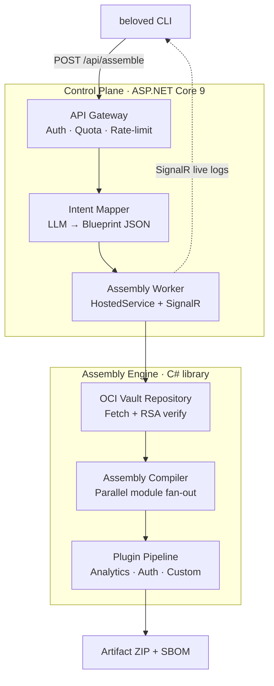

<div align="center">

# Beloved

### *You built something Lovable. Now make it Beloved.*

[](https://github.com/Digvijay/beloved/actions/workflows/ci.yaml)
[](https://github.com/Digvijay/beloved/actions)
[](https://dot.net)
[](https://react.dev)
[](https://opencontainers.org)
[](LICENSE)
[](CONTRIBUTING.md)

<br/>

> Most AI code generators write code line-by-line — probabilistically, expensively, with hallucinations.
> Beloved **assembles** production applications from a vault of pre-audited, cryptographically signed components;
> the same way a compiler links libraries rather than rewriting them.

**`beloved generate "Build a SaaS with auth, billing, and analytics"` → ZIP in seconds.**

</div>

---

## Table of Contents

- [How it works](#how-it-works)
- [Architecture](#architecture)
- [Quick start](#quick-start)
- [Vault modules](#vault-modules)
- [Kubernetes deployment](#kubernetes-deployment)
- [API reference](#api-reference)
- [Development guide](#development-guide)
- [Security](#security)
- [Contributing](#contributing)
- [License](#license)

---

## How it works

Think of building with LEGO bricks. Instead of melting plastic to mould a new brick every time, you open a box of pre-made, tested bricks and snap them together.

1. **Prompt → Blueprint** — The LLM-backed Intent Mapper converts a natural-language prompt into a deterministic `Blueprint JSON` describing which vault modules are required.
2. **Parallel fetch** — The Assembly Engine pulls all modules concurrently from the OCI registry via `Task.WhenAll`, verifying each RSA signature before extraction.
3. **Stitch** — A plugin pipeline injects React views, .NET controllers, navigation, DbSets, and analytics into the base templates.
4. **Artifact** — A SBOM-annotated ZIP is written to the Output Store, ready to download and deploy.

---

## Architecture



| Layer | Stack | Role |
|---|---|---|
| Control Plane | ASP.NET Core 9, EF Core, SignalR | Auth, quotas, queue, webhooks |
| Assembly Engine | C# 13 class library | OCI fetch, parallel stitching, plugins |
| OCI Vault | Distribution Spec v1 | Versioned, signed module storage |
| Frontend scaffold | React 18 + TypeScript + Vite | Static SPA injected per assembly |
| CLI | .NET global tool | `generate`, `login`, `status`, `vault list` |

---

## Quick start

### Prerequisites

| Tool | Version |
|---|---|
| [.NET SDK](https://dot.net) | 9.0+ |
| [Docker](https://docker.com) | 24.0+ |

### 1 — Start infrastructure

```bash
# Spins up the local OCI registry (:5001) and RabbitMQ (:5672)
docker compose up -d
```

### 2 — Run the Control Plane

```bash
dotnet run --project Beloved.ControlPlane
# Listening on http://localhost:3000
# OpenAPI → http://localhost:3000/openapi/v1.json
```

### 3 — Install the CLI and assemble your first app

```bash
# Install from local nupkg
dotnet tool install -g Beloved.Cli --add-source ./Beloved.Cli/nupkg

# Authenticate against the local instance
beloved login --url http://localhost:3000

# Assemble
beloved generate "Build me a SaaS dashboard with auth, billing, and analytics"
```

The CLI streams real-time logs via SignalR, then saves a `<jobId>.zip` containing:
- `frontend/` — React + TypeScript SPA (Vite-buildable)
- `backend/` — ASP.NET Core Web API with EF Core
- `sbom.json` — Full software bill of materials

### 4 — Run tests

```bash
dotnet test Beloved.Tests --verbosity normal
# 30 tests · 0 failures · ~2.5 s
```

---

## Vault modules

Every module is stored in the OCI registry as `modules/<name>:latest`. A module ships:

- `manifest.json` — describes nav item, React imports/views, .NET controllers, and DbSets
- `react-views.tsx` — one or more React components
- `*Controller.cs` — ASP.NET Core controller(s)

| Module | Description | Frontend | Backend |
|---|---|:---:|:---:|
| `auth` | JWT login + registration | ✓ | ✓ |
| `billing` | Stripe-compatible billing + webhooks | ✓ | ✓ |
| `analytics` | Page-view tracking + dashboard | ✓ | ✓ |
| `items` | Generic CRUD resource management | ✓ | ✓ |
| `notifications` | In-app notification centre | ✓ | ✓ |
| `comments` | Threaded comments on any entity | ✓ | ✓ |
| `settings` | User profile + org settings | ✓ | ✓ |
| `storage` | File upload + S3-compatible management | ✓ | ✓ |

### Push a custom module

```bash
# Package and push to the local registry
./push_to_oci.sh module my-feature ./vault/modules/my-feature

# Test immediately
beloved generate "... with my-feature"
```

---

## Kubernetes deployment

Full production Helm chart in [`helm/beloved/`](./helm/beloved/), including KEDA-backed auto-scaling for assembly workers.

```bash
# Inspect rendered manifests
helm install beloved ./helm/beloved --dry-run --debug

# Deploy to your cluster
helm upgrade --install beloved ./helm/beloved \
  --set controlPlane.image.tag=1.0.0 \
  --set postgresql.auth.password=$PGPASSWORD \
  --set rabbitmq.auth.password=$AMQPPASSWORD
```

The KEDA `ScaledObject` in [`worker-keda.yaml`](./helm/beloved/templates/worker-keda.yaml) scales assembly workers 0 → N based on RabbitMQ queue depth.

---

## API reference

Base URL: `http://localhost:3000`  
Full contract: `GET /openapi/v1.json`

| Method | Path | Auth | Description |
|---|---|:---:|---|
| `POST` | `/api/assemble` | API key | Submit an assembly job |
| `GET` | `/api/assemble/{jobId}/status` | API key | Poll job status |
| `GET` | `/api/assemble/{jobId}/download` | API key | Download artifact ZIP |
| `GET` | `/api/assemble/{jobId}/sbom` | API key | Retrieve SBOM JSON |
| `GET` | `/api/vault/modules` | API key | List available modules |
| `POST` | `/api/auth/register` | — | Create a tenant account |
| `POST` | `/api/auth/token` | credentials | Exchange for JWT |
| `GET` | `/api/billing/usage` | JWT | Current usage vs. quota |
| `POST` | `/api/webhooks` | JWT | Register a webhook endpoint |

---

## Development guide

### Repository structure

```
Beloved.AssemblyEngine/     # Core library: OCI client, compiler, plugin pipeline
Beloved.ControlPlane/       # ASP.NET Core 9 Web API
  ├─ Auth/                  # API key + JWT + OAuth2 handlers
  ├─ Controllers/           # REST endpoints
  ├─ Data/                  # EF Core DbContext + migrations
  ├─ Hubs/                  # SignalR assembly hub
  ├─ Middleware/            # Quota enforcement
  └─ Services/              # Worker, outbox mailer, webhook dispatcher
Beloved.Cli/                # .NET global tool
Beloved.Tests/              # xUnit test suite (30 tests)
vault/
  ├─ modules/               # OCI module layers (.tar.gz + source)
  └─ templates/             # Base scaffolds (react-frontend, dotnet-backend)
helm/beloved/               # Kubernetes Helm chart + KEDA scaling
k8s/                        # Raw Kubernetes manifests
```

### Adding a module

1. Copy any existing module directory as a template:
   ```bash
   cp -r vault/modules/analytics vault/modules/my-feature
   ```
2. Edit `manifest.json`, the controller `.cs`, and `react-views.tsx`.
3. Push to the registry:
   ```bash
   ./push_to_oci.sh module my-feature ./vault/modules/my-feature
   ```
4. Verify with `beloved generate "... with my-feature"`.

No changes to the Assembly Engine are needed — module discovery is fully dynamic.

### Environment variables

| Variable | Default | Description |
|---|---|---|
| `DatabaseProvider` | `SQLite` | `SQLite` or `PostgreSQL` |
| `ConnectionStrings__DefaultConnection` | *(SQLite path)* | PostgreSQL connection string |
| `Jwt__Secret` | *(set in appsettings)* | HMAC-SHA256 signing secret (≥ 32 chars) |
| `RabbitMQ__Host` | `localhost` | RabbitMQ hostname |
| `Llm__Provider` | `ollama` | `ollama`, `openai`, `gemini`, `claude` |
| `Llm__ApiKey` | — | API key for the selected LLM provider |

---

## Security

All OCI modules are RSA-signed and verified natively in C# before extraction. No unsigned component ever reaches the assembly workspace — the engine **fails closed**.

To report a vulnerability, please follow the process in [SECURITY.md](./SECURITY.md).  
Do **not** open a public GitHub issue for security bugs.

---

## Contributing

Contributions of new vault modules, engine improvements, CLI commands, and bug fixes are welcome.  
Please read [CONTRIBUTING.md](./CONTRIBUTING.md) before opening a pull request.

---

## License

[MIT](./LICENSE) © 2026 Beloved Build
