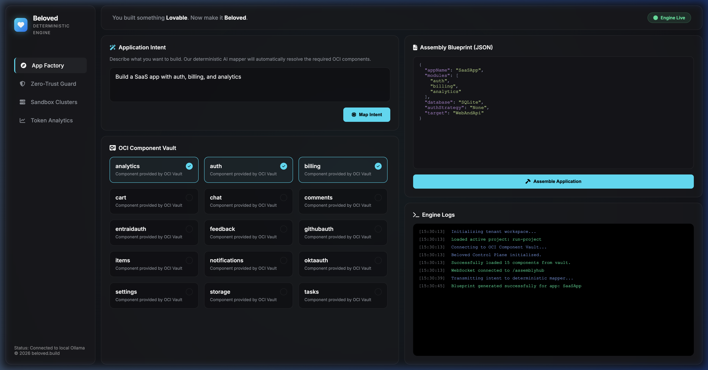
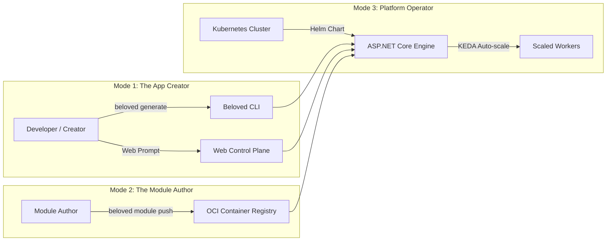
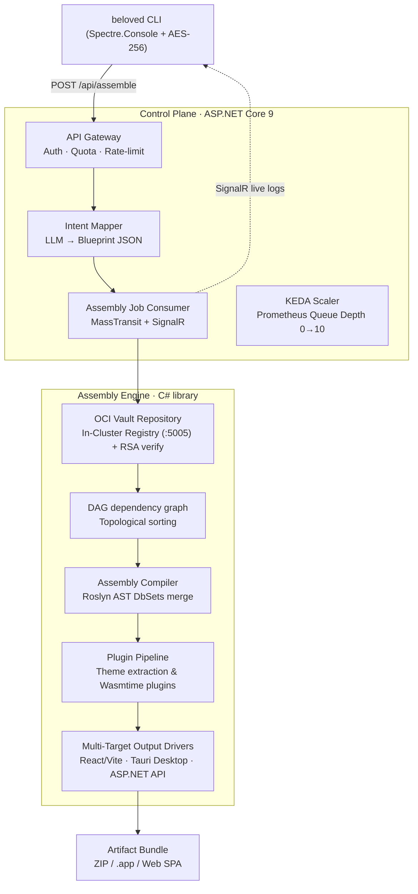

<div align="center">

# Beloved

### *You built something Lovable. Now make it Beloved.*

[](https://github.com/Digvijay/beloved/actions/workflows/ci.yaml)
[](https://github.com/Digvijay/beloved/actions)
[](https://dot.net)
[](https://react.dev)
[](https://opencontainers.org)
[](https://keda.sh)
[](LICENSE)
[](CONTRIBUTING.md)

<br/>

> Most AI code generators write code line-by-line — probabilistically, expensively, with hallucinations.
> Beloved **assembles** production applications from a vault of pre-audited, cryptographically signed components;
> the same way a compiler links libraries rather than rewriting them.

> [!NOTE]
> **Proof of Concept & Vision:** Beloved is a Proof of Concept (PoC) demonstrating how AI-assisted software development can evolve from slow, expensive, token-by-token code generation to deterministic, high-throughput, component-based assembly. It serves as an architectural vision for how next-generation AI platforms can build production applications reliably at scale.

**`beloved generate "Build a SaaS with auth, billing, and analytics"` → ZIP, Web, Desktop (Tauri), or API microservice in seconds.**

<br/>



</div>

---

## Product Vision & Usage Modes

### Why Beloved? (The Assembly Paradigm Shift)

| Metric / Feature | Traditional LLM Code Generators (e.g. Lovable, Cursor) | Beloved Assembly Platform |
|---|---|---|
| **Code Generation Strategy** | Line-by-line probabilistic token generation | Deterministic AST stitching of pre-vetted OCI modules |
| **Token Consumption** | ~50,000+ tokens per generation ($0.50 - $2.00) | **~100 - 500 tokens** per assembly (**$0.0001**) |
| **Generation Speed** | 2 - 5 minutes of streaming text | **< 3 seconds** parallel AST link & output bundle |
| **Build Reliability** | Vulnerable to syntax errors & missing imports | **100% deterministic build guarantee** via Roslyn AST |
| **Component Distribution** | Ephemeral, non-reusable text snippets | **OCI-Compliant Container Registry Artifacts** |

---

### How Beloved is Used (3 Core Modes)


```mermaid
flowchart LR
    subgraph Mode1["Mode 1: The App Creator"]
        User["Developer / Creator"] -->|"beloved generate"| CLI["Beloved CLI"]
        User -->|"Web Prompt"| UI["Web Control Plane"]
    end

    subgraph Mode2["Mode 2: The Module Author"]
        Author["Module Author"] -->|"beloved module push"| OCI["OCI Container Registry"]
    end

    subgraph Mode3["Mode 3: Platform Operator"]
        K8s["Kubernetes Cluster"] -->|"Helm Chart"| ControlPlane["ASP.NET Core Engine"]
        ControlPlane -->|"KEDA Auto-scale"| Workers["Scaled Workers"]
    end

    CLI --> ControlPlane
    UI --> ControlPlane
    OCI --> ControlPlane
```

1. **Mode 1 — The App Creator ("Works for a Nobody")**:
   - Zero-setup developer experience. Enter a prompt like *"Build a SaaS with auth, billing, and Stripe webhooks"* via CLI or Web Dashboard. Get a complete, runnable codebase in seconds.
2. **Mode 2 — The Module Author (Enterprise Ecosystem)**:
   - Create custom reusable UI/backend building blocks (`beloved module init`), package them into OCI image layers, and push them to public or private OCI registries (`beloved module push`).
3. **Mode 3 — The Cloud Platform Operator (Massive Concurrency)**:
   - Deploy Beloved to Kubernetes via Helm. Scale multi-tenant assembly workers from 0 → 100 with KEDA based on job queue load, serving millions of request assemblies per second.

---

## Table of Contents

- [Product Vision & Usage Modes](#product-vision--usage-modes)
- [How it works](#how-it-works)
- [Architecture](#architecture)
- [E2E Verification Walkthrough](./docs/walkthrough.md)
- [Platform Stitching Roadmap](./docs/ROADMAP.md)
- [Quick start](#quick-start)
- [Vault modules](#vault-modules)
- [Kubernetes deployment (KinD + KEDA + OCI Registry)](#kubernetes-deployment)
- [Multi-Target Output Drivers](#multi-target-output-drivers)
- [API reference](#api-reference)
- [Development guide](#development-guide)
- [Security](#security)
- [Contributing](#contributing)
- [License](#license)

---

## How it works

Think of building with LEGO bricks. Instead of melting plastic to mould a new brick every time, you open a box of pre-made, tested bricks and snap them together.

1. **Prompt → Blueprint** — The LLM-backed Intent Mapper converts a natural-language prompt into a deterministic `Blueprint JSON` describing which vault modules are required.
2. **Parallel fetch** — The Assembly Engine pulls all modules concurrently from the OCI registry via `Task.WhenAll`, verifying each RSA signature before extraction.
3. **Stitch** — A plugin pipeline injects React views, .NET controllers, navigation, DbSets, and analytics into the base templates.
4. **Multi-Target Output & SBOM** — Emits SBOM-annotated (`sbom.json`) compile-ready static SPA Web Apps (React/Vite), Native Desktop/Mobile apps (Tauri), or ASP.NET Core Minimal API Backend Microservices.

---

## Architecture


```mermaid
graph TD
    CLI["beloved CLI (Spectre.Console + AES-256)"]

    subgraph "Control Plane  ·  ASP.NET Core 9"
        GW["API Gateway\nAuth · Quota · Rate-limit"]
        IQ["Intent Mapper\nLLM → Blueprint JSON"]
        WK["Assembly Job Consumer\nMassTransit + SignalR"]
        KEDA["KEDA Scaler\nPrometheus Queue Depth 0→10"]
    end

    subgraph "Assembly Engine  ·  C# library"
        OCI["OCI Vault Repository\nIn-Cluster Registry (:5005) + RSA verify"]
        DAG["DAG dependency graph\nTopological sorting"]
        COMP["Assembly Compiler\nRoslyn AST DbSets merge"]
        PLUG["Plugin Pipeline\nTheme extraction & Wasmtime plugins"]
        DRV["Multi-Target Output Drivers\nReact/Vite · Tauri Desktop · ASP.NET API"]
    end

    OUT["Artifact Bundle\nZIP / .app / Web SPA"]

    CLI -->|"POST /api/assemble"| GW
    GW --> IQ --> WK
    WK --> OCI --> DAG --> COMP --> PLUG --> DRV --> OUT
    WK -.->|"SignalR live logs"| CLI
```

| Layer | Stack | Role |
|---|---|---|
| Control Plane | ASP.NET Core 9, EF Core, SignalR | Auth, quotas, queue, webhooks |
| Assembly Engine | C# 13 class library | OCI fetch, parallel stitching, Wasm plugins |
| In-Cluster OCI Vault | Distribution Spec v1 (`registry:2.8.2`) | Versioned, signed module storage at `:5005` |
| Output Drivers | React/Vite, Tauri (Rust), ASP.NET Core | Multi-target Web, Desktop, and API code generation |
| CLI | .NET tool (`CommandLineParser` + `Spectre.Console`) | `generate`, `login`, `logout`, `module push`, `module catalog` |

---

## Quick start

### Prerequisites

| Tool | Version |
|---|---|
| [.NET SDK](https://dot.net) | 9.0+ |
| [Docker](https://docker.com) | 24.0+ |
| [KinD](https://kind.sigs.k8s.io) | 0.20+ (Optional for Kubernetes E2E) |
| [Helm](https://helm.sh) | 3.0+ (Optional for Kubernetes E2E) |

### 1 — Start infrastructure

```bash
# Spins up local Prometheus telemetry (:9090) and Grafana dashboard (:3000)
docker compose -f deploy/docker-compose.telemetry.yml up -d
```

### 2 — Run the Control Plane

```bash
dotnet run --project Beloved.ControlPlane
# Listening on http://localhost:3000
# OpenAPI → http://localhost:3000/openapi/v1.json
# Prometheus Metrics → http://localhost:3000/metrics
```

### 3 — Install the CLI and assemble your first app

```bash
# Authenticate against local instance (Credentials encrypted via AES-256 GCM)
beloved login --url http://localhost:3000

# Assemble Web, Desktop (Tauri), or API app
beloved generate "Build me a SaaS dashboard with auth, billing, and analytics"
```

The CLI streams real-time logs via SignalR, then saves a `<jobId>.zip` containing:
- `frontend/` — React + TypeScript SPA (Vite-buildable)
- `backend/` — ASP.NET Core Web API with EF Core
- `src-tauri/` — Tauri Rust desktop configuration (`tauri.conf.json`, `Cargo.toml`, `main.rs`)
- `sbom.json` — Full software bill of materials

### 0 — Install Beloved CLI via .NET Tool (NuGet)

```bash
# Option A: Install globally via .NET Tool from NuGet / GitHub Packages
dotnet tool install --global Beloved.Cli --version 0.1.0

# Option B: Pack and install locally from source
dotnet pack Beloved.Cli/Beloved.Cli.csproj -c Release -o ./nupkg
dotnet tool install --global --add-source ./nupkg Beloved.Cli
```

Automated NuGet packaging and publishing is handled via [.github/workflows/publish-cli-nuget.yml](.github/workflows/publish-cli-nuget.yml) whenever a release tag (`v*`) is pushed.

### 4 — Run tests

```bash
dotnet test Beloved.Tests --verbosity normal
# 128 tests · 0 failures · ~4.0 s
```

---

## Vault modules

Every module is stored in the OCI registry as `modules/<name>:latest`. A module ships:

- `manifest.json` — describes nav item, React imports/views, .NET controllers, and DbSets
- `react-views.tsx` — one or more React components
- `*Controller.cs` — ASP.NET Core controller(s)

| Module | Description | Frontend | Backend |
|---|---|:---:|:---:|
| `auth` | JWT login + registration | ✓ | ✓ |
| `billing` | Stripe-compatible billing + webhooks | ✓ | ✓ |
| `analytics` | Page-view tracking + dashboard | ✓ | ✓ |
| `items` | Generic CRUD resource management | ✓ | ✓ |
| `notifications` | In-app notification centre | ✓ | ✓ |
| `comments` | Threaded comments on any entity | ✓ | ✓ |
| `settings` | User profile + org settings | ✓ | ✓ |
| `storage` | File upload + S3-compatible management | ✓ | ✓ |

### Push a custom module to OCI Registry

```bash
# Initialize boiler plate
beloved module init my-feature

# Package and push directly to OCI-compliant registry
beloved module push my-feature http://localhost:5005

# Search/Catalog published modules
beloved module catalog http://localhost:5005
```

---

## Kubernetes deployment

Full production Helm chart located in [`deploy/helm/beloved/`](./deploy/helm/beloved/), including **In-Cluster OCI Container Registry** and **KEDA-backed Event-Driven Autoscaling**.

### 1 — Spin up local KinD Kubernetes Cluster

```bash
# Create KinD cluster with NodePort mappings (8080 -> ControlPlane, 5005 -> OCI Registry)
kind create cluster --config deploy/kind-config.yaml

# Build and load Control Plane Docker image
docker build -t beloved/controlplane:0.1.0 -f Beloved.ControlPlane/Dockerfile .
kind load docker-image beloved/controlplane:0.1.0 --name beloved-cluster

# Install KEDA CRDs
kubectl apply --server-side -f https://github.com/kedacore/keda/releases/download/v2.12.0/keda-2.12.0.yaml
```

### 2 — Deploy Beloved Helm Chart

```bash
helm upgrade --install beloved ./deploy/helm/beloved --namespace beloved-system --create-namespace
```

### 3 — Verify End-to-End Kubernetes Resources

```bash
# Verify Pods, In-Cluster OCI Registry, and KEDA ScaledObject
kubectl get pods,svc,scaledobject -n beloved-system

# Live HTTP Health Probes
curl -s http://localhost:8080/healthz/live
curl -s http://localhost:8080/healthz/ready

# In-Cluster OCI Layer Push Test
beloved module push my-module http://localhost:5005
curl -s http://localhost:5005/v2/_catalog
```

The KEDA `ScaledObject` ([`scaledobject.yaml`](./deploy/helm/beloved/templates/scaledobject.yaml)) automatically scales `beloved` pods from 1 → 10 based on Prometheus pending job metrics.

---

## Multi-Target Output Drivers

Beloved supports multi-target output generation via [`IOutputTargetDriver`](./Beloved.AssemblyEngine/Drivers/IOutputTargetDriver.cs):

1. **`ReactViteWebDriver`** — Generates React 18 + TypeScript + Vite static Web Application bundles.
2. **`TauriAppDriver`** — Synthesizes cross-platform desktop application bundles with native Rust entry points (`src-tauri/src/main.rs`, `Cargo.toml`, `tauri.conf.json`).
3. **`AspNetCoreApiDriver`** — Generates scalable ASP.NET Core Minimal API microservice scaffolds.

---

## API reference

Base URL: `http://localhost:3000`  
Full contract: `GET /openapi/v1.json`

| Method | Path | Auth | Description |
|---|---|:---:|---|
| `POST` | `/api/assemble` | API key | Submit an assembly job |
| `GET` | `/api/artifacts/{jobId}` | API key | Download artifact ZIP |
| `GET` | `/api/jobs/{jobId}/sbom` | API key | Retrieve SBOM JSON |
| `GET` | `/api/modules` | API key | List available modules |
| `GET` | `/api/modules/search` | API key | Search vault modules |
| `GET` | `/auth/login/github` | — | Initiate GitHub OAuth login |
| `GET` | `/auth/login/google` | — | Initiate Google OAuth login |
| `GET` | `/auth/me` | JWT | Get current authenticated user |
| `POST` | `/auth/token/refresh` | JWT | Refresh access token |
| `GET` | `/api/billing/plan` | JWT | Get current billing plan |
| `POST` | `/api/billing/checkout` | JWT | Create billing checkout session |
| `GET` | `/api/billing/portal` | JWT | Get billing portal URL |
| `POST` | `/api/webhooks` | JWT | Register a webhook endpoint |
| `GET` | `/api/webhooks` | JWT | List registered webhooks |
| `POST` | `/api/intent` | API key | Map intent prompt to Blueprint JSON |
| `POST` | `/api/k8s/validate` | — | Kubernetes Validating Admission Webhook |

---

## Development guide

### Repository structure

```
Beloved.AssemblyEngine/     # Core library: OCI client, compiler, plugin pipeline
Beloved.ControlPlane/       # ASP.NET Core 9 Web API
  ├─ Auth/                  # API key + JWT + OAuth2 handlers
  ├─ Controllers/           # REST endpoints
  ├─ Data/                  # EF Core DbContext + migrations
  ├─ Hubs/                  # SignalR assembly hub
  ├─ Middleware/            # Quota enforcement
  └─ Services/              # Worker, outbox mailer, webhook dispatcher
Beloved.Cli/                # .NET global tool
Beloved.Tests/              # xUnit test suite (128 tests)
vault/
  ├─ modules/               # OCI module layers (.tar.gz + source)
  └─ templates/             # Base scaffolds (react-frontend, dotnet-backend)
helm/beloved/               # Kubernetes Helm chart + KEDA scaling
k8s/                        # Raw Kubernetes manifests
```

### Adding a module

1. Copy any existing module directory as a template:
   ```bash
   cp -r vault/modules/analytics vault/modules/my-feature
   ```
2. Edit `manifest.json`, the controller `.cs`, and `react-views.tsx`.
3. Push to the registry:
   ```bash
   ./push_to_oci.sh module my-feature ./vault/modules/my-feature
   ```
4. Verify with `beloved generate "... with my-feature"`.

### Verification and Walkthroughs

For a detailed step-by-step E2E setup, assembly run, database migration, and browser UI verification walkthrough, refer to the [Verification Walkthrough](./docs/walkthrough.md).

### Environment variables

| Variable | Default | Description |
|---|---|---|
| `DatabaseProvider` | `SQLite` | `SQLite` or `PostgreSQL` |
| `ConnectionStrings__DefaultConnection` | *(SQLite path)* | PostgreSQL connection string |
| `Jwt__Secret` | *(set in appsettings)* | HMAC-SHA256 signing secret (≥ 32 chars) |
| `RabbitMQ__Host` | `localhost` | RabbitMQ hostname |
| `Llm__Provider` | `ollama` | `ollama`, `openai`, `gemini`, `claude` |
| `Llm__ApiKey` | — | API key for the selected LLM provider |

## Innovative Distributed Features

Beloved implements three next-generation cloud-native architectures:

1. **WebAssembly Dynamic Loading (Wasmtime .NET)**: Supports running isolated module extensions inside a pluggable WASM runner via Wasmtime, failing closed if binaries are tampered with.
2. **Self-Optimizing Telemetry Worker**: Continuously monitors latency metrics to dynamically re-compile and scale optimized assembly plans.
3. **Kubernetes Validating Admission Webhook**: Intecepts K8s deployment reviews at `/api/k8s/validate` to enforce Cosign signature requirements on container images.

---

## Security

All OCI modules are RSA-signed and verified natively in C# before extraction. No unsigned component ever reaches the assembly workspace — the engine **fails closed**.

To report a vulnerability, please follow the process in [SECURITY.md](./SECURITY.md).  
Do **not** open a public GitHub issue for security bugs.

---

## Contributing

Contributions of new vault modules, engine improvements, CLI commands, and bug fixes are welcome.  
Please read [CONTRIBUTING.md](./CONTRIBUTING.md) before opening a pull request.

---

## Disclaimer

This repository contains AI-assisted architectural scaffolding and code. All generated modules, assemblies, and infrastructure templates are designed to be thoroughly audited, tested, and validated in sandbox environments before deployment to production.

---

## License

[MIT](./LICENSE) © 2026 Digvijay Chauhan & Beloved Contributors
